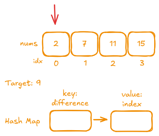
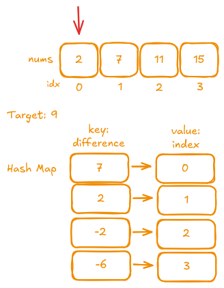
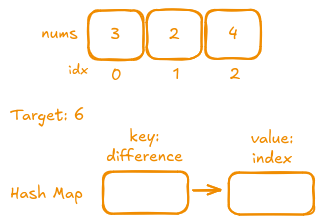
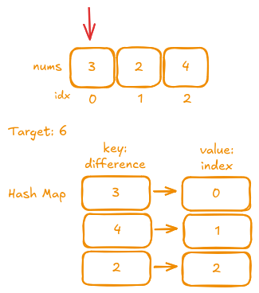

## Description

Given an array of integers `nums` and an integer `target`, return indices of the two numbers such that they add up to `target`.

You may assume that each input would have exactly one solution, and you may not use the same element twice.

You can return the answer in any order.

### Examples

- **Example 1:**
  - **Input:** `nums = [2,7,11,15], target = 9`
  - **Output:** `[0,1]`
  - **Explanation:** Because `nums[0] + nums[1] == 9`, we return `[0, 1]`.

- **Example 2:**
  - **Input:** `nums = [3,2,4], target = 6`
  - **Output:** `[1,2]`

- **Example 3:**
  - **Input:** `nums = [3,3], target = 6`
  - **Output:** `[0,1]`

### Constraints

- 2 <= nums.length <= 10<sup>4</sup>
- -10<sup>9</sup> <= nums[i] <= 10<sup>9</sup>
- -10<sup>9</sup> <= target <= 10<sup>9</sup>
- Only one valid answer exists.

## Test

```rust
#[cfg(test)]
mod tests {
    use super::*;

    #[test]
    fn example1() {
        let nums = vec![2, 7, 11, 15];
        let target = 9;
        let result = Solution::two_sum(nums, target);
        assert_eq!(result.len(), 2);
        assert!(result.contains(&0));
        assert!(result.contains(&1));
    }

    #[test]
    fn example2() {
        let nums = vec![3, 2, 4];
        let target = 6;
        let result = Solution::two_sum(nums, target);
        assert_eq!(result.len(), 2);
        assert!(result.contains(&1));
        assert!(result.contains(&2));
    }

    #[test]
    fn example3() {
        let nums = vec![3, 3];
        let target = 6;
        let result = Solution::two_sum(nums, target);
        assert_eq!(result.len(), 2);
        assert!(result.contains(&0));
        assert!(result.contains(&1));
    }

    #[test]
    fn additional_test() {
        let nums = vec![1, 2, 3, 4];
        let target = 7;
        let result = Solution::two_sum(nums, target);
        assert_eq!(result.len(), 2);
        assert!(result.contains(&2));
        assert!(result.contains(&3));
    }

    #[test]
    fn empty_input() {
        let nums = vec![];
        let target = 0;
        let result = Solution::two_sum(nums, target);
        assert!(result.is_empty());
    }
}
```

## Prototype

```rust
pub fn two_sum(nums: Vec<i32>, target: i32) -> Vec<i32> {
    todo!()
}
```

## Solutions

### Brute force

The most obvious solution is just to try all variants.

```rust
pub fn two_sum(nums: Vec<i32>, target: i32) -> Vec<i32> {
    for i in 0..nums.len() {
        for j in (i + 1)..nums.len() {
            if nums[i] + nums[j] == target {
                return vec![i as i32, j as i32];
            }
        }
    }
    vec![]
}
```

- **Time Complexity:** O(n²)  
- **Space Complexity:** O(1)

### Hash Map

The problem becomes much easier when we look at it from a different angle. Instead of trying to find two unknown numbers simultaneously, we can search for their difference. With this approach, we determine exactly what number is needed to complement a given number to reach the target. We solve the problem using only two iterations and a hash map. The hash map stores the difference between the target and each number, along with the index of that number. Let's break it down step by step.

#### Valid Example

Consider the example: `nums = [2,7,11,15]` with `target = 9`.


---

In the first iteration, we start with the number `2`. We calculate `9 - 2 = 7` and store `7` as a key in the hash map with the value `0` (the index of `2`).
")

---

Next, we process the second number, `7`. We compute `9 - 7 = 2` and store this result as a key with the value `1` (the index of `7`).
")

---

Then, for the third number `11`, we calculate `9 - 11 = -2` and store this as a key with the value `2` (the index of `11`).
")

---

Finally, for the fourth number `15`, we compute `9 - 15 = -6` and store it as a key with the value `3` (the index of `15`).
")

---

Now that the hash map is built, we perform a second iteration to find a match.


In the second iteration, our goal is to check if the current number appears as a key in the hash map. In other words, we want to find any number whose difference with the target equals the current number. The value stored in the hash map for that key is the index of the number that, when added to the current number, reaches the target.The search in hash map is very cheap, in almost all cases it is `O(1)`.

Thus, when we encounter the number `2` at index `0`, we find that `2` is present as a key in the hash map (stored during the processing of `7` at index `1`). This indicates that the first number `2` and the number `7` complement each other to reach the target, resulting in the answer `[0, 1]`.

#### Edge Case

Consider the example: `nums = [3,2,4]` with `target = 6`.



For the first number, compute `6 - 3 = 3` and store `3` as a key in the hash map with the value `0` (the index of `3`).

")

For the second number, compute `6 - 2 = 4` and store `4` as a key with the value `1` (the index of `2`).

")

For the third number, compute `6 - 4 = 2` and store `2` as a key with the value `2` (the index of `4`).

")

At this point, everything seems correct since `4 + 2 = 6`, so the answer should be `[1, 2]`. However, there's a subtle detail in our algorithm:



If the hash map contains a key representing a difference of `3` for the current number, that key corresponds to the number at index `0`. Without proper handling, the algorithm would incorrectly return `[0, 0]`—the same number twice. We must ensure that the value associated with the key providing this difference is not equal to the index of the current number.

#### Implementation

```rust
pub fn two_sum(nums: Vec<i32>, target: i32) -> Vec<i32> {
    // Build a hash map where each key is the difference (i.e., target - number)
    // and the corresponding value is the index of that number.
    let storage: HashMap<i32, usize> = nums
        .iter()
        .enumerate()
        .map(|(i, &v)| (target - v, i))
        .collect();

    for (i, num) in nums.iter().enumerate() {
        // Check if the current number exists in the hash map as a difference.
        if let Some(&idx) = storage.get(&num) {
            // Ensure that the current number and its difference are not the same element.
            if idx != i {
                return vec![i as i32, idx as i32];
            }
        }
    }
    // Return an empty vector if no valid pair is found.
    vec![]
}
```

- **Time Complexity:** O(n)  
- **Space Complexity:** O(n)

---

### Hash Map with one pass

Once we understand how the hash map solution works, it becomes much easier to eliminate the second iteration. As mentioned in the hash map implementation, the main challenge is that both numbers are unknown. However, we actually identify one number while creating the hash map, so we can perform this check during the iteration.

```rust
pub fn two_sum(nums: Vec<i32>, target: i32) -> Vec<i32> {
    let mut storage = HashMap::new();

    for (i, num) in nums.into_iter().enumerate() {
        // Check if the current number exists in the hash map as a difference.
        // The second check that it is not the same element is not needed anymore.
        if let Some(&idx) = storage.get(&num) {
            return vec![i as i32, idx as i32];
        }
        // Otherwise continue the iteration, and build the hash map.
        storage.insert(target - num, i);
    }
    vec![]
}
```

- **Time Complexity:** O(n)  
- **Space Complexity:** O(n)
