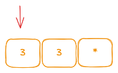
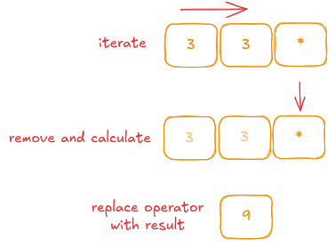
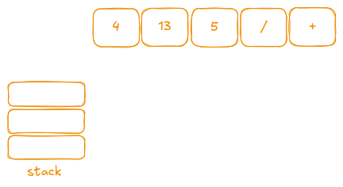
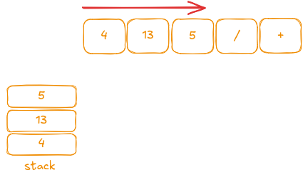
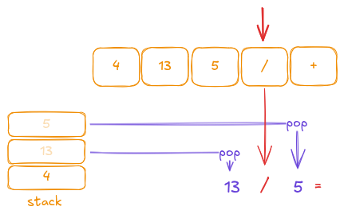
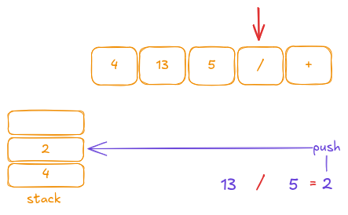
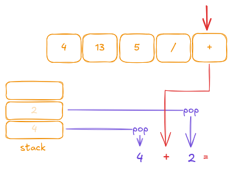
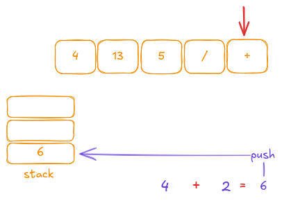

## Description

You are given an array of strings `tokens` that represents an arithmetic expression in a <a href="https://en.wikipedia.org/wiki/Reverse_Polish_notation" target="_blank">Reverse Polish Notation</a>.

Evaluate the expression. Return *an integer that represents the value of the expression*.

**Note** that:

- The valid operators are `'+'`, `'-'`, `'*'`, and `'/'`.
- Each operand may be an integer or another expression.
- The division between two integers always truncates *toward zero*.
- There will not be any division by zero.
- The input represents a valid arithmetic expression in a reverse polish notation.
- The answer and all the intermediate calculations can be represented in a *32-bit* integer.

### Examples

- **Example 1:**
  - **Input:** `tokens = ["2","1","+","3","*"]`
  - **Output:** `9`
  - **Explanation:** `((2 + 1) * 3) = 9`

- **Example 2:**
  - **Input:** `tokens = ["4","13","5","/","+"]`
  - **Output:** `6`
  - **Explanation:** `(4 + (13 / 5)) = 6`

- **Example 3:**
  - **Input:** `tokens = ["10","6","9","3","+","-11","*","/","*","17","+","5","+"]`
  - **Output:** `22`
  - **Explanation:**  

    ```
    ((10 * (6 / ((9 + 3) * -11))) + 17) + 5
    = ((10 * (6 / (12 * -11))) + 17) + 5
    = ((10 * (6 / -132)) + 17) + 5
    = ((10 * 0) + 17) + 5
    = (0 + 17) + 5
    = 17 + 5
    = 22
    ```

### Constraints

- 1 <= tokens.length <= 10<sup>4</sup>
- `tokens[i]` is either an operator: `"+"`, `"-"`, `"*"`, or `"/"`, or an integer in the range `[-200, 200]`.

## Test

```rust
#[cfg(test)]
mod tests {
    use super::*;

    #[test]
    fn test_example1() {
        let tokens = vec!["2", "1", "+", "3", "*"]
            .iter()
            .map(|s| s.to_string())
            .collect::<Vec<_>>();
        assert_eq!(eval_rpn(tokens), 9);
    }

    #[test]
    fn test_example2() {
        let tokens = vec!["4", "13", "5", "/", "+"]
            .iter()
            .map(|s| s.to_string())
            .collect::<Vec<_>>();
        assert_eq!(eval_rpn(tokens), 6);
    }

    #[test]
    fn test_example3() {
        let tokens = vec![
            "10", "6", "9", "3", "+", "-11", "*", "/", "*", "17", "+", "5", "+"
        ]
            .iter()
            .map(|s| s.to_string())
            .collect::<Vec<_>>();
        assert_eq!(eval_rpn(tokens), 22);
    }

    #[test]
    fn test_single_number() {
        let tokens = vec!["42"]
            .iter()
            .map(|s| s.to_string())
            .collect::<Vec<_>>();
        assert_eq!(eval_rpn(tokens), 42);
    }

    #[test]
    fn test_complex_expression() {
        // This evaluates to ((3 + 4) * 2) / 7 = (7 * 2) / 7 = 14 / 7 = 2.
        let tokens = vec!["3", "4", "+", "2", "*", "7", "/"]
            .iter()
            .map(|s| s.to_string())
            .collect::<Vec<_>>();
        assert_eq!(eval_rpn(tokens), 2);
    }

    #[test]
    fn test_negative_numbers() {
        // Expression: -2 3 * 4 +  -> (-2 * 3) + 4 = -6 + 4 = -2
        let tokens = vec!["-2", "3", "*", "4", "+"]
            .iter()
            .map(|s| s.to_string())
            .collect::<Vec<_>>();
        assert_eq!(eval_rpn(tokens), -2);
    }
}
```

## Prototype

```rust
pub fn eval_rpn(tokens: Vec<String>) -> i32 {
    todo!()
}
```

## Solutions

### Brute Force

My brute force solution is truly brute 😂. In Rust, the standard `LinkedList` API is rather poor and unstable, so I decided to use a vector's `remove` method instead—even though it is expensive because it copies the remainder of the vector.
The idea is to iterate through the vector, and when we encounter an operator, we remove the preceding elements (which are guaranteed to be numbers), compute the result, and replace the operator with the result. Then we repeat this process until the expression is fully evaluated.

---

Let's don't spend too much time on explanation, let's take an example `"2", "1", "+", "3", "*"`:

Iteration until find operator:


---

The first operator is `+`, we remove 2 previous elements, calculate and save result in place of our current operator.



---



```rust
use std::str::FromStr;

pub fn eval_rpn(mut tokens: Vec<String>) -> i32 {
    let is_operator = |s: &str| s == "+" || s == "-" || s == "*" || s == "/";
    let mut i = 0;
    while i < tokens.len() {
        if is_operator(tokens[i].as_str()) {
            let op2 = i32::from_str(tokens.remove(i - 1).as_str()).unwrap();
            let op1 = i32::from_str(tokens.remove(i - 2).as_str()).unwrap();
            i -= 2;
            let res = match tokens[i].as_str() {
                "+" => op1 + op2,
                "-" => op1 - op2,
                "*" => op1 * op2,
                _ => op1 / op2,
            };
            tokens[i] = res.to_string();
        }
        i += 1
    }
    i32::from_str(tokens[0].as_str()).unwrap()
}
```

- **Time Complexity:** O(n²)  
- **Space Complexity:** O(n)

### Stack

Personally, the **stack solution** is one of the most fundamental approaches because it is very easy to understand and implement. Recall that the problem guarantees that the given Reverse Polish Notation (RPN) is valid. Therefore, during the iteration:

- When encountering a **number**, we push it onto the stack.
- When encountering an **operator**, it is guaranteed that there are at least two numbers on the stack. This allows us to safely pop the top two numbers, perform the operation, and then push the result back onto the stack.
- The final result will be on the **top** of the stack.

Let's illustrate this with an example: `tokens = ["4", "13", "5", "/", "+"]`.



---

When iterating through the tokens, the first three elements are numbers. We push them onto the stack one by one.



---

Then we encounter the `/` operator. At this point, we pop two elements from the stack to evaluate the operation. Remember that the elements are popped in reverse order compared to how they were pushed. The order matters because we want to compute `13 / 5`, not `5 / 13`. The first pop gives us the **second operand**, and the second pop gives us the **first operand**.



---

Then we push the result onto the stack.



---

The next token is the `+` operator, which we handle in the same way:



Then we push the result onto the stack:



Finally, we can be sure that the notation is correct, and there will always be exactly one number on the stack at the end. Thus, the final result is obtained by popping the number from the stack.

---

```rust
use std::str::FromStr;

pub fn eval_rpn(tokens: Vec<String>) -> i32 {
    let mut stack = vec![];

    for token in tokens {
        if let Ok(num) = i32::from_str(token.as_str()) {
            stack.push(num)
        } else {
            let op2 = stack.pop().unwrap();
            let op1 = stack.pop().unwrap();
            let res = match token.as_str() {
                "+" => op1 + op2,
                "-" => op1 - op2,
                "*" => op1 * op2,
                _ => op1 / op2,
            };
            stack.push(res)
        }
    }
    stack.pop().unwrap()
}
```

- **Time Complexity:** O(n)  
- **Space Complexity:** O(n)
