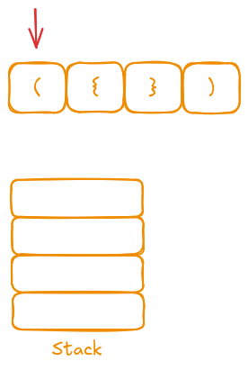
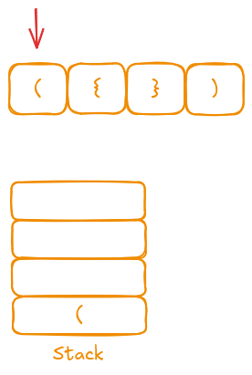
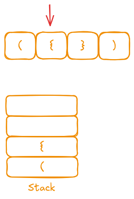
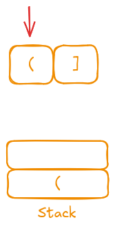

## Description

Given a string `s` containing just the characters `'('`, `')'`, `'{'`, `'}'`, `'['` and `']'`, determine if the input string is valid.

An input string is valid if:
- Open brackets must be closed by the same type of brackets.
- Open brackets must be closed in the correct order.
- Every close bracket has a corresponding open bracket of the same type.

### Examples

- **Example 1:**
  - **Input:** `s = "()"`
  - **Output:** `true`
  
- **Example 2:**
  - **Input:** `s = "()[]{}"`
  - **Output:** `true`
  
- **Example 3:**
  - **Input:** `s = "(]"`
  - **Output:** `false`
  
- **Example 4:**
  - **Input:** `s = "([])"`
  - **Output:** `true`

### Constraints
- 1 <= s.length <= 10<sup>4</sup>
- `s` consists of parentheses only `'()[]{}'`.

## Test

```rust
fn main() {
    assert_eq!(Solution::is_valid(String::from("()")), true);
    assert_eq!(Solution::is_valid(String::from("()[]{}")), true);
    assert_eq!(Solution::is_valid(String::from("([])")), true);
    assert_eq!(Solution::is_valid(String::from("(]")), false);
    assert_eq!(Solution::is_valid(String::from("(")), false);
    assert_eq!(Solution::is_valid(String::from("())")), false);
    assert_eq!(Solution::is_valid(String::from("))(")), false);

    assert_eq!(Solution::is_valid(String::from("[]")), true);
    assert_eq!(Solution::is_valid(String::from("{}")), true);
    assert_eq!(Solution::is_valid(String::from("[({})]")), true);
    assert_eq!(Solution::is_valid(String::from("({[()]})")), true);
    assert_eq!(Solution::is_valid(String::from("([)]")), false);
    assert_eq!(Solution::is_valid(String::from("(()))")), false);
    assert_eq!(Solution::is_valid(String::from("((()")), false);
    assert_eq!(Solution::is_valid(String::from("){")), false);
    assert_eq!(Solution::is_valid(String::from("{[}]}")), false);
}
```

## Prototype

```rust
struct Solution; // should not be included when submit

impl Solution {
    pub fn is_valid(s: String) -> bool {
        todo!()
    }
}
```

## Solutions

### Brute force

We can break the problem into smaller parts. Essentially, the parentheses are valid only when each opening symbol is immediately followed by its corresponding closing symbol (e.g., (), {}, []). In our loop, we check if the string contains any of these sequences and remove them. If the string becomes empty after all removals, the parentheses are valid; otherwise, they are not.

```rust
// we can modify the given argument to be mutable
pub fn is_valid(mut s: String) -> bool {
    while s.contains("{}") || s.contains("[]") || s.contains("()") {
        s = s.replace("{}", "");
        s = s.replace("()", "");
        s = s.replace("[]", "");
    }
    s.is_empty()
}
```

- **Time Complexity:** O(n²)  
- **Space Complexity:** O(n)


### Stack

The stack solution allows us to solve the problem in a single iteration over the given string. Essentially, we store our opening characters on a stack, and when we encounter a closing character, we compare it with the top of the stack. If they match, we pop the stack; otherwise, the string is invalid.

#### Valid example

Let's consider a valid example: `"({})"`.

  
We start the iteration with the `"("` symbol. Since it's an opening character, we push it onto the stack.

  
Next, we encounter `"{"`, which is also an opening character, so we push it onto the stack.

  
Now, we encounter a closing character `"}"`. We compare it with the top of the stack. Since the top is `"{"`, they match, so we pop the stack.

 with ( and popping from the stack")  
Finally, we encounter `")"`. The top of the stack is `"("`, so we pop it. The iteration is complete and our stack is empty, which means the string is valid.

#### Not valid examples and edge cases

#### Example 1
We can try `"(]"`.


We start with the opening `"("`, we push it onto the stack.

![Iteration 2: Encountering "\]" and comparing with the stack top](20-valid-parentheses-notvalid-1-2.png "Iteration 2: Comparing ] with the stack top")
The next character is a closing `"]"`. We compare it with the top of the stack where we store the opening characters in reverse order.

It is `"("`, and it doesn't match. The string is not valid.

#### Example 2
The string value is `"]"`.
![Iteration 1: Encountering \] with an empty stack](20-valid-parentheses-notvalid-2-1.png "Iteration 1: Encountering ] with an empty stack")

The current character is `"]"`. We compare it with the top of the stack, but the stack is empty—this is an edge case that should be handled.

#### Implementation


```rust
pub fn is_valid(s: String) -> bool {
    let mut stack: Vec<char> = Vec::new();

    for current_char in s.chars() {
        match (stack.last(), current_char) {
            // If the stack is empty (the last stack element is None)
            //or the current character is an opening symbol, push it onto the stack.
            (None, _) | (_, '{') | (_, '(') | (_, '[') => stack.push(current_char),
            // If the top of the stack is the matching opening symbol
            // for the current closing symbol, pop it.
            (Some('{'), '}') | (Some('('), ')') | (Some('['), ']') => {
                stack.pop();
            }
            // Otherwise, the string is invalid.
            _ => return false,
        }
    }
    // String is valid when there are no more chars on stack
    stack.is_empty()
}
```


- **Time Complexity:** O(n)  
- **Space Complexity:** O(n)