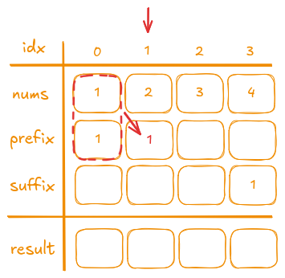

## Description

Given an integer array `nums`, return an array `answer` such that `answer[i]` is equal to the product of all the elements of `nums` except `nums[i]`.

The product of any prefix or suffix of `nums` is guaranteed to fit in a **32-bit integer**.

You must write an algorithm that runs in `O(n)` time and **without using the division operation**.

### Examples

- **Example 1:**
  - **Input:** `[1,2,3,4]`
  - **Output:** `[24,12,8,6]`
- **Example 2:**
  - **Input:** `[-1,1,0,-3,3]`
  - **Output:** `[0,0,9,0,0]`

### Constraints

- 2 <= `nums.length` <= 10<sup>5</sup>
- `-30 <= nums[i] <= 30`
- The input is generated such that `answer[i]` is guaranteed to fit in a 32-bit integer.

> Follow up: Can you solve the problem in `O(1)` extra space complexity? (The output array **does not** count as extra space for space complexity analysis.)

## Test

```rust
#[cfg(test)]
mod tests {
    use super::*;

    #[test]
    fn test_example1() {
        let nums = vec![1, 2, 3, 4];
        let result = product_except_self(nums);
        let expected = vec![24, 12, 8, 6];
        assert_eq!(result, expected);
    }

    #[test]
    fn test_example2() {
        let nums = vec![-1, 1, 0, -3, 3];
        let result = product_except_self(nums);
        let expected = vec![0, 0, 9, 0, 0];
        assert_eq!(result, expected);
    }

    #[test]
    fn test_all_positive() {
        let nums = vec![2, 3, 4, 5];
        let result = product_except_self(nums);
        // For nums = [2, 3, 4, 5]:
        // Total product = 2 * 3 * 4 * 5 = 120
        // Expected = [120/2, 120/3, 120/4, 120/5] = [60, 40, 30, 24]
        let expected = vec![60, 40, 30, 24];
        assert_eq!(result, expected);
    }

    #[test]
    fn test_with_negative_numbers() {
        let nums = vec![1, -2, 3, -4];
        let result = product_except_self(nums);
        // For nums = [1, -2, 3, -4]:
        // Expected product array = [(-2*3*-4), (1*3*-4), (1*-2*-4), (1*-2*3)] = [24, -12, 8, -6]
        let expected = vec![24, -12, 8, -6];
        assert_eq!(result, expected);
    }

    #[test]
    fn test_with_zeros() {
        let nums = vec![0, 4, 0, 5];
        let result = product_except_self(nums);
        // For nums = [0, 4, 0, 5]:
        // Multiple zeros in the array result in all zeros.
        let expected = vec![0, 0, 0, 0];
        assert_eq!(result, expected);
    }
}
```

## Prototype

```rust
pub fn product_except_self(nums: Vec<i32>) -> Vec<i32> {
    todo!()        
}
```

## Solutions

### Brute Force

I like to start solving problems with **brute force** solutions when possible, even if I end up with *Time Limit Exceeded*. It helps me understand the problem much better.

Actually, everything here is quite simple—there's nothing complicated to explain. We iterate over the entire array every time and calculate the product for each number *except itself*. Notice that we recalculate everything repeatedly, which suggests that there is a way to pre-calculate parts of the computation.

```rust
pub fn product_except_self(nums: Vec<i32>) -> Vec<i32> {
    let mut res = Vec::with_capacity(nums.len());

    for i in 0..nums.len() {
        let mut product = 1;
        for (y, &n) in nums.iter().enumerate() {
            if y != i {
                product *= n
            }
        }
        res.push(product)
    }
    res
}
```

- **Time Complexity:** O(n²)  
- **Space Complexity:** O(1) - answer isn't included to calculate the final space complexity.

---

### Division

The first way we can pre-calculate everything is the most obvious one—multiply all the numbers together and then divide that product by each number to find the result. Although this approach is **forbidden** by the problem description, it serves as a good educational example to understand how it works.
There are two edge cases to consider, both related to **division by zero**, but let's examine it step by step.

#### Division with no edge cases handled

Let's consider, for example, `nums = vec![1, 2, 3, 4]`.

- First, we calculate the product of the entire array, which is **24**.
- Then, we iterate one more time and divide the product by each number, so `[24/1, 24/2, 24/3, 24/4]` becomes `[24, 12, 8, 6]`.

```rust
// Note that this is not the final solution.
pub fn product_except_self(nums: Vec<i32>) -> Vec<i32> {
    let product: i32 = nums.iter().product();
    nums.iter().map(|&v| product / v).collect()
}
```

#### Edge Case 1: Multiple Zeros

When there are multiple zeros in the `nums` array, every product will be `0` because multiplying any number by `0` results in `0`. Therefore, in this case, we can immediately return an array of zeros.

Let's consider, for example, `nums = vec![0, 1, 2, 3, 4, 0]`.

```rust
// Note that this is not the final solution.
pub fn product_except_self(nums: Vec<i32>) -> Vec<i32> {
    let mut zeros_count = 0;
    let mut product = 1;

    for (i, &num) in nums.iter().enumerate() {
        if num == 0 {
            zeros_count += 1
        } else {
            product *= num
        }
    }

    match zeros_count {
        2.. => vec![0; nums.len()],
        _ => nums.iter().map(|&v| product / v).collect(),
    }
}
```

#### Edge Case 2: One Zero

When there is exactly one `0` in the `nums` array, the product for every element (except the `0` itself) will be `0` because multiplying any number by `0` yields `0`. The only exception is the element that is `0`—its product will be the product of all non-zero numbers. Therefore, we can directly return an array of zeros with the computed product placed at the index corresponding to the single zero.

```rust
// Final solution
pub fn product_except_self(nums: Vec<i32>) -> Vec<i32> {
    let (mut zero_idx, mut zeros_count) = (0, 0);
    let mut product = 1;

    for (i, &num) in nums.iter().enumerate() {
        if num == 0 {
            zero_idx = i;
            zeros_count += 1
        } else {
            product *= num
        }
    }

    match zeros_count {
        1 => {
            let mut res = vec![0; nums.len()];
            res[zero_idx] = product;
            res
        }
        2.. => vec![0; nums.len()],
        _ => nums.iter().map(|&v| product / v).collect(),
    }
}
```

---

### Prefix and Suffix

#### Approach

Since we can't use division, we need another approach to pre-calculate the product. A good method is to use two additional vectors:

- **Prefix**: This vector stores the product of all numbers before each index.
- **Suffix**: This vector stores the product of all numbers after each index.

Let's take, for example, `nums = [1, 2, 3, 4]`:


Since there are no numbers before the first element and after the last element of `nums`, the `first element` in the `prefix` vector and the `last element` in the `suffix` vector are **always** set to `1`.

---

#### Iteration on Prefix

The iteration to pre-calculate all products for the **prefix** vector starts at index `1` because we already know that the product of all numbers **before** `nums[0]` is `1`.

To compute the product for all numbers before `nums[i]`, we:

- Take the product stored in `prefix[i - 1]` (which represents the product of all numbers before `nums[i - 1]`).
- Multiply it by `nums[i - 1]`.
- Store the result in `prefix[i]`.



---

For example, during the second iteration (at index `2`):

- The previous number (`nums[1]`) is `2`.
- The product stored in `prefix[1]` is `1`.
- We multiply them: `1 * 2 = 2`.
- We then store `2` in `prefix[2]`.


---

The third and the last iteration (at index `3`):

- The previous number (`nums[2]`) is `3`.
- The product stored in `prefix[2]` is `2`.
- We multiply them: `3 * 2 = 6`.
- We then store `6` in `prefix[3]`.


For example, the product of all numbers before `nums[3]` is stored in `prefix[3]`:  
`1 * 2 * 3 = 6`.

---

#### Iteration on Suffix

The same logic is applied to calculate the **suffix** vector, but we iterate in reverse order. Since we already know that there are no numbers after the last element, the last element in the suffix vector is set to `1`. We then start the iteration from the element before the last one.

For example, in this case, assume the iteration starts at index `2`:

- The next number (`nums[i + 1]`) is `4`.
- The product stored in `suffix[i + 1]` is `1`.
- We multiply them: `4 * 1 = 4`.
- We then store `4` in `suffix[2]`.


---

In the following iteration, moving one step further in reverse order:

- Suppose we are now at index `1`.
- The next number (`nums[i + 1]`) is the value stored at index `2` (which we calculated as `4` in the previous step).
- The product stored in `suffix[i + 1]` (i.e., `suffix[2]`) is `4`.
- We multiply them: `value * 4`.
- For instance, if `nums[1]` is `3`, then `3 * 4 = 12` is computed.
- We then store `12` in `suffix[1]`.


---

And the last one:


---

We can as well check if everything is correct:


For example, let's take `nums[1]` is `2`. Before index `1`, we only have the number `1`, so the product is `1` and `prefix[1]` is `1`. After index `1`, there are two numbers, `3` and `4`, whose product is `12`. This value is stored in `suffix[1]`. Everything works as expected!

---

#### Calculating Result

Now, to compute the final result, we simply multiply the corresponding values from the **prefix** and **suffix** arrays at each index.


#### Implementation

```rust
pub fn product_except_self(nums: Vec<i32>) -> Vec<i32> {
    // Initialize with 1 to set the prefix as the first element
    // and the suffix as the last element.
    let mut prefix = vec![1; nums.len()];
    let mut suffix = vec![1; nums.len()];

    for i in 1..nums.len() {
        prefix[i] = prefix[i - 1] * nums[i - 1];
    }
    for i in (0..nums.len() - 1).rev() {
        suffix[i] = suffix[i + 1] * nums[i + 1];
    }

    prefix
        .into_iter()
        .zip(suffix.into_iter())
        .map(|(v1, v2)| v1 * v2)
        .collect()
}
```

- **Time Complexity:** O(n)  
- **Space Complexity:** O(n)

### Prefix and Suffix with no extra memory

> TODO
