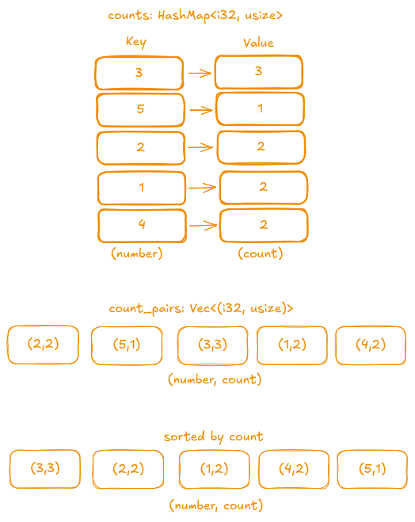
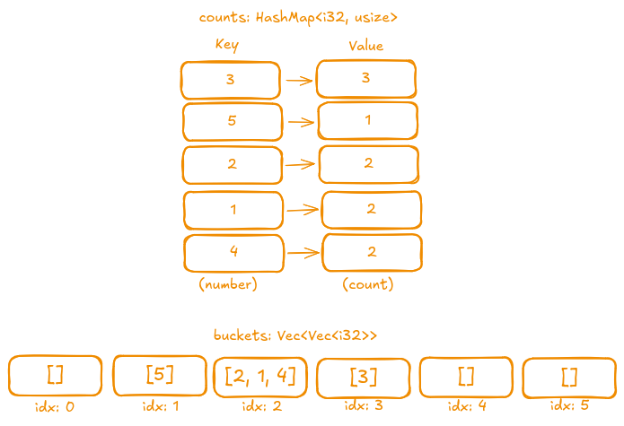

## Description

Given an integer array `nums` and an integer `k`, return the `k` *most frequent elements*. You may return the answer in **any order**.

### Examples

- **Example 1:**
  - **Input:** `nums = [1,1,1,2,2,3], k = 2`
  - **Output:** `[1,2]`
- **Example 4:**
  - **Input:** `nums = [1], k = 1`
  - **Output:** `[1]`

### Constraints

- 1 <= nums.length <= 10<sup>5</sup>
- -10<sup>4</sup> <= nums[i] <= 10<sup>4</sup>
- `k` is in the range `[1, the number of unique elements in the array].`
- It is **guaranteed** that the answer is unique.

> Follow up: Your algorithm's time complexity must **be better than** `O(n log n)`, where `n` is the array's size.

## Test

```rust
#[cfg(test)]
mod tests {
    use super::*;

    #[test]
    fn test_example1() {
        let nums = vec![1, 1, 1, 2, 2, 3];
        let k = 2;
        let mut result = top_k_frequent(nums, k);
        result.sort();
        let mut expected = vec![1, 2];
        expected.sort();
        assert_eq!(result, expected);
    }

    #[test]
    fn test_example2() {
        let nums = vec![1];
        let k = 1;
        let result = top_k_frequent(nums, k);
        let expected = vec![1];
        assert_eq!(result, expected);
    }

    #[test]
    fn test_empty_input() {
        let nums: Vec<i32> = vec![];
        let k = 0;
        let result = top_k_frequent(nums, k);
        let expected: Vec<i32> = vec![];
        assert_eq!(result, expected);
    }

    #[test]
    fn test_all_same_elements() {
        let nums = vec![4, 4, 4, 4];
        let k = 1;
        let result = top_k_frequent(nums, k);
        let expected = vec![4];
        assert_eq!(result, expected);
    }

    #[test]
    fn test_more_frequent_elements_than_k() {
        let nums = vec![1, 1, 2, 2, 3, 3, 3, 4, 4, 5];
        let k = 2;
        let result = top_k_frequent(nums, k);
        // The two most frequent elements are 3 and (1,2, or 4); order may vary.
        // We ensure that 3 is always present.
        assert!(result.contains(&3));
        // Also check that the result length is k.
        assert_eq!(result.len(), k as usize);
    }
}
```

## Prototype

```rust
pub fn top_k_frequent(nums: Vec<i32>, k: i32) -> Vec<i32> {
    todo!()
}
```

## Solutions

We face several challenges in this problem. First, we need **to count the occurrences of each number**, and a **hash map** is an excellent data structure for storing **a number as a key along with its occurrence count**. *We will use it in both solutions.*

The second challenge is how to transform this hash map into the final result, and this part differs between solutions.

- Another **important** condition, that we can return **same** counts in any order! For example if `k` is `1` and top frequent are `2, 3, 4` we can return **any number**.

**Function Skeleton:**

```rust
pub fn top_k_frequent(nums: Vec<i32>, k: i32) -> Vec<i32> {
    let mut counts: HashMap<i32, usize> = HashMap::new();

    // Count how many times each number occurs.
    for num in nums {
        *counts.entry(num).or_insert(0) += 1;
    }
    todo!()
}
```

---

### Sorting

Since we already have our hash map with counts, we can **sort** these occurrence counts without losing track of which number they belong to. In this solution, we transform the initial vector several times:

- **Step 1:** Convert our hash map into a vector of tuples, where one element is the number and the other is its occurrence count.
- **Step 2:** Sort the vector by counts in decreasing order.
- **Step 3:** After sorting, take only the top `k` elements and extract the numbers.

For example, consider `vec![1, 1, 2, 2, 3, 3, 3, 4, 4, 5]` to see how the mapping will look at different stages.



```rust
pub fn top_k_frequent(nums: Vec<i32>, k: i32) -> Vec<i32> {
    let mut counts: HashMap<i32, usize> = HashMap::new();

    // Count how many times each number occurs.
    for num in nums {
        *counts.entry(num).or_insert(0) += 1;
    }

    // Convert the hash map to a vector of tuples (number, count).
    let mut count_pairs = counts.into_iter().collect::<Vec<_>>();
    // Sort the vector by counts in decreasing order.
    count_pairs.sort_by(|(_, count1), (_, count2)| count2.cmp(count1));
    // Extract only the numbers from the top k elements.
    count_pairs
        .into_iter()
        .map(|(val, _)| val)
        .take(k as usize)
        .collect()
}
```

- **Time Complexity:** O(n log n)  
- **Space Complexity:** O(n)

---

### Bucket Sort

The other approach is to use **bucket sort**. For this method, we represent our buckets as a **vector** where the **index** represents the **count** and the **value** is a **list of numbers**. We use the index as the count because we know that the maximum count is `initial vector size + 1`, and the buckets will be naturally ordered. We use a vector for the values because multiple numbers can occur the same number of times.

For example, consider `vec![1, 1, 2, 2, 3, 3, 3, 4, 4, 5]` to see how the mapping will look at different stages.



```rust
pub fn top_k_frequent(nums: Vec<i32>, k: i32) -> Vec<i32> {
    let mut counts: HashMap<i32, usize> = HashMap::new();
    let mut buckets = vec![vec![]; nums.len() + 1];

    // Count how many times each number occurs.
    for num in nums {
        *counts.entry(num).or_insert(0) += 1;
    }

    // Push each number into the corresponding bucket.
    for (num, count) in counts {
        buckets[count].push(num);
    }

    buckets
        .into_iter()
        // Flatten the buckets into a single iterator.
        .flatten()
        // Reverse to start from the most frequent numbers.
        .rev()
        // Take only k elements.
        .take(k as usize)
        .collect()
}
```

- **Time Complexity:** O(n)  
- **Space Complexity:** O(n)
