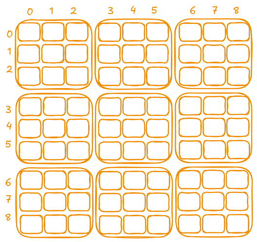
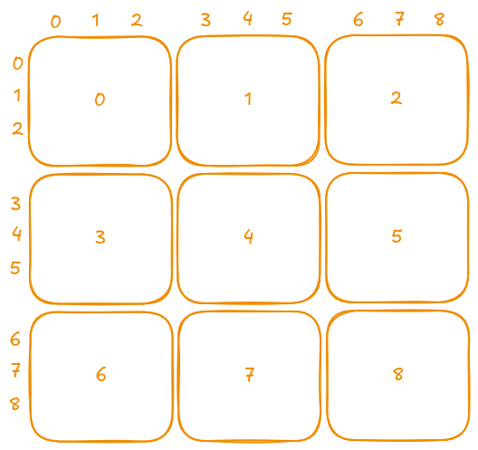

## Description

Determine if a `9 x 9` Sudoku board is valid. Only the filled cells need to be validated **according to the following rules**:

1. Each row must contain the digits `1-9` without repetition.
2. Each column must contain the digits `1-9` without repetition.
3. Each of the nine `3 x 3` sub-boxes of the grid must contain the digits `1-9` without repetition.

Note:

- A Sudoku board (partially filled) could be valid but is not necessarily solvable.
- Only the filled cells need to be validated according to the mentioned rules.

### Examples

**Example 1:**

  

- **Example 1:**
  - **Input:**

    ```python
    board = [
      ["5","3",".",".","7",".",".",".","."],
      ["6",".",".","1","9","5",".",".","."],
      [".","9","8",".",".",".",".","6","."],
      ["8",".",".",".","6",".",".",".","3"],
      ["4",".",".","8",".","3",".",".","1"],
      ["7",".",".",".","2",".",".",".","6"],
      [".","6",".",".",".",".","2","8","."],
      [".",".",".","4","1","9",".",".","5"],
      [".",".",".",".","8",".",".","7","9"]
    ]
    ```

  - **Output:**: `true`

- **Example 2:**
  - **Input:**

    ```python
    board = [
      ["8","3",".",".","7",".",".",".","."],
      ["6",".",".","1","9","5",".",".","."],
      [".","9","8",".",".",".",".","6","."],
      ["8",".",".",".","6",".",".",".","3"],
      ["4",".",".","8",".","3",".",".","1"],
      ["7",".",".",".","2",".",".",".","6"],
      [".","6",".",".",".",".","2","8","."],
      [".",".",".","4","1","9",".",".","5"],
      [".",".",".",".","8",".",".","7","9"]
    ]
    ```

  - **Output:**: `false`
  - **Explanation:**: Same as Example 1, except with the **5** in the top left corner being modified to **8**. Since there are two 8's in the top left 3x3 sub-box, it is invalid.

### Constraints

- `board.length == 9`
- `board[i].length == 9`
- `board[i][j]` is a digit `1-9` or `'.'`

## Test

```rust
#[cfg(test)]
mod tests {
    use super::*;

    // Helper function to convert a 2D array of &str into Vec<Vec<char>>
    fn board_from_str(board: &[&[&str; 9]; 9]) -> Vec<Vec<char>> {
        board
            .iter()
            .map(|row| row.iter().map(|&s| s.chars().next().unwrap()).collect())
            .collect()
    }

    #[test]
    fn test_valid_sudoku() {
        let board = board_from_str(&[
            &["5","3",".",".","7",".",".",".","."],
            &["6",".",".","1","9","5",".",".","."],
            &[".","9","8",".",".",".",".","6","."],
            &["8",".",".",".","6",".",".",".","3"],
            &["4",".",".","8",".","3",".",".","1"],
            &["7",".",".",".","2",".",".",".","6"],
            &[".","6",".",".",".",".","2","8","."],
            &[".",".",".","4","1","9",".",".","5"],
            &[".",".",".",".","8",".",".","7","9"],
        ]);
        assert!(is_valid_sudoku(board));
    }

    #[test]
    fn test_invalid_sudoku_duplicate_in_row() {
        // Duplicate "8" in the first row
        let board = board_from_str(&[
            &["8","3",".",".","7",".",".",".","8"],
            &["6",".",".","1","9","5",".",".","."],
            &[".","9","8",".",".",".",".","6","."],
            &["8",".",".",".","6",".",".",".","3"],
            &["4",".",".","8",".","3",".",".","1"],
            &["7",".",".",".","2",".",".",".","6"],
            &[".","6",".",".",".",".","2","8","."],
            &[".",".",".","4","1","9",".",".","5"],
            &[".",".",".",".","8",".",".","7","9"],
        ]);
        assert!(!is_valid_sudoku(board));
    }

    #[test]
    fn test_invalid_sudoku_duplicate_in_column() {
        // Duplicate "6" in the first column
        let board = board_from_str(&[
            &["5","3",".",".","7",".",".",".","."],
            &["6",".",".","1","9","5",".",".","."],
            &["6","9","8",".",".",".",".","6","."],
            &["8",".",".",".","6",".",".",".","3"],
            &["4",".",".","8",".","3",".",".","1"],
            &["7",".",".",".","2",".",".",".","6"],
            &[".","6",".",".",".",".","2","8","."],
            &[".",".",".","4","1","9",".",".","5"],
            &[".",".",".",".","8",".",".","7","9"],
        ]);
        assert!(!is_valid_sudoku(board));
    }

    #[test]
    fn test_invalid_sudoku_duplicate_in_sub_box() {
        // Duplicate "9" in the top left 3x3 box
        let board = board_from_str(&[
            &["5","3","9",".","7",".",".",".","."],
            &["6",".",".","1","9","5",".",".","."],
            &[".","9","8",".",".",".",".","6","."],
            &["8",".",".",".","6",".",".",".","3"],
            &["4",".",".","8",".","3",".",".","1"],
            &["7",".",".",".","2",".",".",".","6"],
            &[".","6",".",".",".",".","2","8","."],
            &[".",".",".","4","1","9",".",".","5"],
            &[".",".",".",".","8",".",".","7","9"],
        ]);
        assert!(!is_valid_sudoku(board));
    }

    #[test]
    fn test_valid_sudoku_alternate() {
        // Another valid sudoku board example (could be a different valid configuration)
        let board = board_from_str(&[
            &[".",".",".",".",".",".",".",".","."],
            &[".",".",".",".",".",".",".",".","."],
            &[".",".",".",".",".",".",".",".","."],
            &[".",".",".",".",".",".",".",".","."],
            &[".",".",".",".",".",".",".",".","."],
            &[".",".",".",".",".",".",".",".","."],
            &[".",".",".",".",".",".",".",".","."],
            &[".",".",".",".",".",".",".",".","."],
            &[".",".",".",".",".",".",".",".","."],
        ]);
        // An empty board is considered valid as no rules are broken.
        assert!(is_valid_sudoku(board));
    }

    #[test]
    fn test_invalid_sudoku_multiple_errors() {
        // Board with multiple errors: duplicate in row and column
        let board = board_from_str(&[
            &["5","3",".",".","7",".",".","3","."], // duplicate "3" in row
            &["6",".",".","1","9","5",".",".","."],
            &[".","9","8",".",".",".",".","6","."],
            &["8",".",".",".","6",".",".",".","3"],
            &["4",".",".","8",".","3",".",".","1"],
            &["7",".",".",".","2",".",".",".","6"],
            &[".","6",".",".",".",".","2","8","."],
            &[".",".",".","4","1","9",".",".","5"],
            &[".",".",".",".","8",".",".","7","9"],
        ]);
        assert!(!is_valid_sudoku(board));
    }
}
```

## Prototype

```rust
pub fn is_valid_sudoku(board: Vec<Vec<char>>) -> bool {
    todo!()
}
```

## Solutions

### Bruteforce & Bitwise

I like to present brute force solutions because they are simpler and help in understanding the problem. However, in this case, I believe the **HashSet** solution is much simpler.

There is also another solution using **bitwise operations** to reduce the **Space Complexity** to **O(n)**, I'll do it later.

### Hash Set

We should divide the problem into smaller pieces; we should not try to solve everything at once. Let's start with rows and columns. We need to check if all elements in each row and column are unique.

#### Rows And Columns

  

One of the most efficient ways to do this is to use a **HashSet**. Since we plan to use a hash set, we need another data structure to store a hash set for each row and each column. We can use **vectors**, as it is easy to reference each hash set by its index.

```rust
pub fn is_valid_sudoku(board: Vec<Vec<char>>) -> bool {
    const GRID_SIZE: usize = 9;
    let mut rows = vec![HashSet::new(); GRID_SIZE];
    let mut columns = vec![HashSet::new(); GRID_SIZE];

    todo!()
}
```

Then, we iterate over the two-dimensional array and insert each element into the appropriate hash set. The `insert` method returns `false` if the element is already present in the hash set—meaning that a duplicate exists in that row or column—and we can immediately return `false`. According to the description, the initial array contains either `'.'` or ASCII digits. Therefore, when we encounter a `'.'`, we do nothing, otherwise, we insert the element.

```rust
pub fn is_valid_sudoku(board: Vec<Vec<char>>) -> bool {
    const GRID_SIZE: usize = 9;
    let mut rows = vec![HashSet::new(); GRID_SIZE];
    let mut columns = vec![HashSet::new(); GRID_SIZE];

    // iteration over all rows and columns
    for row in 0..GRID_SIZE {
        for col in 0..GRID_SIZE {
            // current char
            let c = board[row][col];
            // do nothing if not ASCII digit
            if c == '.' {
                continue;
            }
            // if duplicate
            if !rows[row].insert(c) {
                return false;
            }
            // if duplicate
            if !columns[col].insert(c) {
                return false;
            }
        }
    }
    true
}
```

---

#### Internal Boxes

More than half of the work is already done, now we only need to handle the internal boxes. We can split these boxes and treat them similarly to rows or columns.



As we see in the picture, we can index each box from `0` to `8` and use the same vector of **HashSet**.
The only challenge is to calculate the correct index for each internal box. We can compute the index using the following formula:

`(row / 3) * 3 + (col / 3)`

**Explanation:**

- Dividing `row` by `3` groups the rows into three segments.
- Dividing `col` by `3` groups the columns into three segments.
- Multiplying the row group by `3` and adding the column group produces a unique index (from `0` to `8`) for each 3x3 box.

#### Implementation

```rust
pub fn is_valid_sudoku(board: Vec<Vec<char>>) -> bool {
    const GRID_SIZE: usize = 9;
    let mut rows = vec![HashSet::new(); GRID_SIZE];
    let mut columns = vec![HashSet::new(); GRID_SIZE];
    let mut boxes = vec![HashSet::new(); GRID_SIZE];

    for row in 0..GRID_SIZE {
        for col in 0..GRID_SIZE {
            let c = board[row][col];
            if c == '.' {
                continue;
            }
            if !rows[row].insert(c) {
                return false;
            }
            if !columns[col].insert(c) {
                return false;
            }
            let box_index = (row / 3) * 3 + (col / 3);
            if !boxes[box_index].insert(c) {
                return false;
            }
        }
    }
    true
}
```

- **Time Complexity:** O(n²) — Even though we perform a single pass through the board, we process n² elements.
- **Space Complexity:** O(n²)
