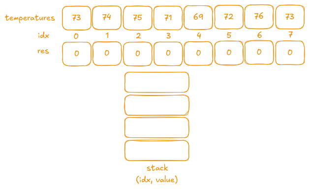
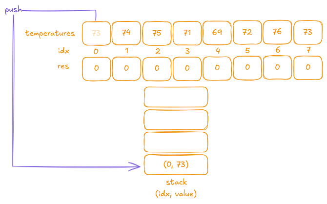
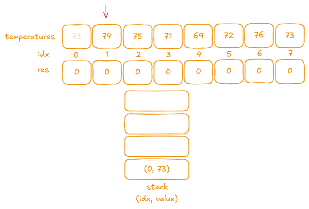
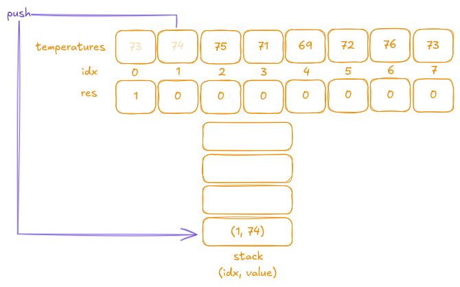
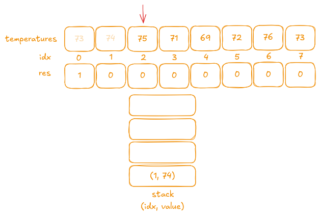
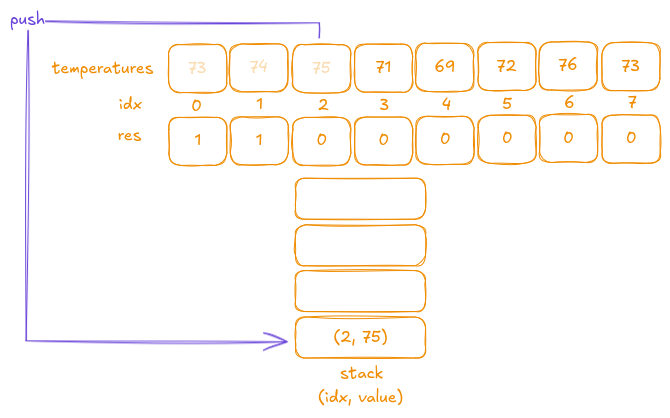
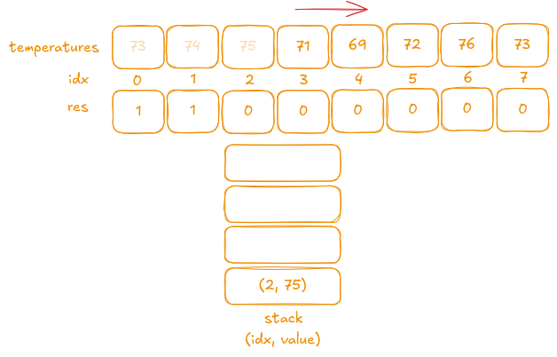
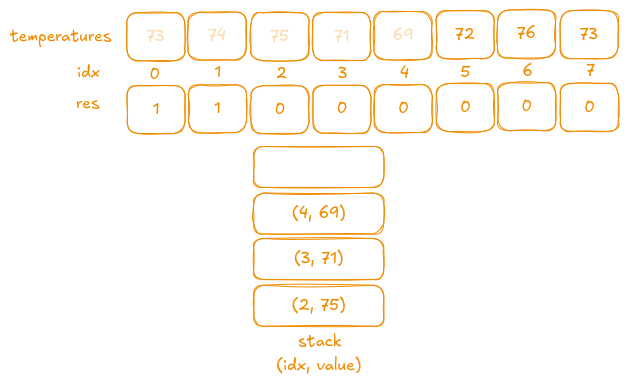
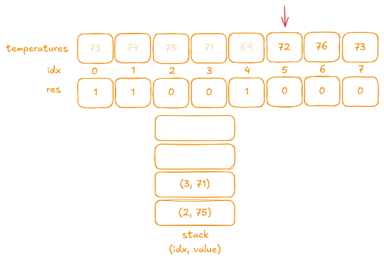
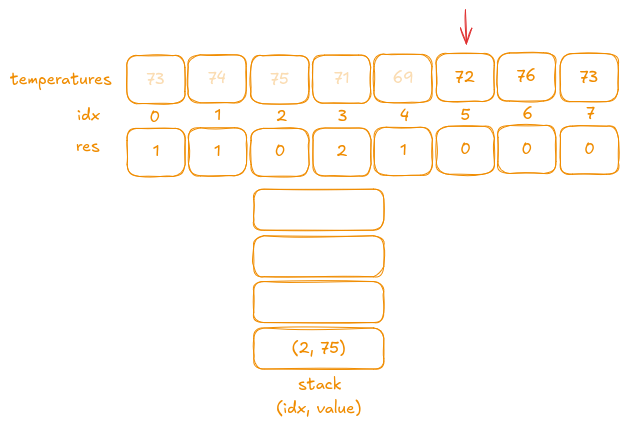

## Description

Given an array of integers `temperatures` represents the daily temperatures, return an array `answer` such that `answer[i]` is the number of days you have to wait after the `ith` day to get a warmer temperature. If there is no future day for which this is possible, keep `answer[i] == 0` instead.

### Examples

- **Example 1:**
  - **Input:** `temperatures = [73,74,75,71,69,72,76,73]`
  - **Output:** `[1,1,4,2,1,1,0,0]`

- **Example 2:**
  - **Input:** `temperatures = [30,40,50,60]`
  - **Output:** `[1,1,1,0]`

- **Example 3:**
  - **Input:** `temperatures = [30,60,90]`
  - **Output:** `[1,1,0]`

### Constraints

- 1 <= temperatures.length <= 10<sup>5</sup>
- `30 <= temperatures[i] <= 100`

## Test

```rust
#[cfg(test)]
mod tests {
    use super::*;

    #[test]
    fn test_example1() {
        let temperatures = vec![73, 74, 75, 71, 69, 72, 76, 73];
        let result = daily_temperatures(temperatures);
        let expected = vec![1, 1, 4, 2, 1, 1, 0, 0];
        assert_eq!(result, expected);
    }

    #[test]
    fn test_example2() {
        let temperatures = vec![30, 40, 50, 60];
        let result = daily_temperatures(temperatures);
        let expected = vec![1, 1, 1, 0];
        assert_eq!(result, expected);
    }

    #[test]
    fn test_example3() {
        let temperatures = vec![30, 60, 90];
        let result = daily_temperatures(temperatures);
        let expected = vec![1, 1, 0];
        assert_eq!(result, expected);
    }

    #[test]
    fn test_single_element() {
        let temperatures = vec![50];
        let result = daily_temperatures(temperatures);
        let expected = vec![0];
        assert_eq!(result, expected);
    }

    #[test]
    fn test_descending_order() {
        let temperatures = vec![100, 90, 80, 70];
        let result = daily_temperatures(temperatures);
        let expected = vec![0, 0, 0, 0];
        assert_eq!(result, expected);
    }

    #[test]
    fn test_all_same() {
        let temperatures = vec![50, 50, 50, 50];
        let result = daily_temperatures(temperatures);
        let expected = vec![0, 0, 0, 0];
        assert_eq!(result, expected);
    }
}
```

## Prototype

```rust
pub fn daily_temperatures(temperatures: Vec<i32>) -> Vec<i32> {
    todo!()
}
```

## Solutions

### Brute Force

The brute force solution is, as always, not very efficient—one test may even fail with a timeout. We can "trick" this test because it contains many duplicates, but let's not spend too much time on that. The idea is simple: we use nested loops to iterate until we find a number greater than the current one.

```rust
pub fn daily_temperatures(temperatures: Vec<i32>) -> Vec<i32> {
    let mut res = vec![0; temperatures.len()];
    for (i, &num) in temperatures.iter().enumerate() {
        for y in i..temperatures.len() {
            if temperatures[y] > num {
                res[i] = (y - i) as i32;
                break;
            }
        }
    }
    res
}
```

- **Time Complexity:** O(n²)  
- **Space Complexity:** O(n)

### Stack

The stack solution is straightforward to implement. Let's start with an example:

- **Input:** `temperatures = [73,74,75,71,69,72,76,73]`
- **Output:** `[1,1,4,2,1,1,0,0]`



First, we initialize the `res` vector with all zeroes as a default value when no higher temperature is found. With a stack, we push a tuple `(index, temperature)` onto it, and whenever we encounter a temperature greater than the one at the top of the stack, we pop from the stack.

There are a couple of challenges to note:

- **Index Difference:**  
  Each value in the output represents the difference in indexes between the current temperature and the next higher temperature. Therefore, we need to keep track of the indexes by using a tuple `(index, value)`.

- **Multiple Elements on the Stack:**  
  In some cases, there may be multiple elements on the stack waiting for a higher temperature. Our solution should handle these scenarios appropriately.

---

Let's walk through the iteration:

1. **Iteration 1:**  
   The first value is `73`. Since the stack is empty, we push `(0, 73)` onto the stack.

   

2. **Iteration 2:**  
   The next value is `74`, which is greater than the temperature at the top of the stack (`73`).  

   

   We pop the tuple `(0, 73)` from the stack. The difference in indexes is `1 - 0 = 1`, so we set `res[0]` to `1`. And then we push the current `temperature[i]` onto stack to find a higher value for it as well.

   

3. **Iteration 3:**  
   The next value is `75`, which is greater than the current stack top `74`. We follow the same steps as before: pop the top element, calculate the difference in indexes, and update the result.

     
   

4. **Iteration 4 & 5:**  
   I'll combine the next two iterations because the same action is performed in both. Consider the next two values:

   

   As shown, the next value `71` is less than the current stack top `75`, so we push it onto the stack. Then, the following value `69` is less than the new stack top `71`, so it is also pushed onto the stack.

   

   > **FYI:** On the stack, we now see (from top to bottom): `69, 71, 75`. This structure is called a **Monotonic Decreasing Stack**.

5. **Iteration 6:**  
   The next value is `72`, which is greater than the top of the stack `69`. We pop the tuple `(4, 69)`. The current index is `5`, so we update `res[4]` to `5 - 4`.

   

   Since `69` has been popped, the new stack top is `71`, and `72` is greater than `71` as well. To handle temperatures that are higher after more than one day, we continue to pop elements while the current value exceeds the stack top.

   Next, we pop the tuple `(3, 71)`. The current index is still `5`, so we update `res[3]` to `5 - 3`.

   

   We can handle now all cases.

```rust
pub fn daily_temperatures(temperatures: Vec<i32>) -> Vec<i32> {
    let mut res = vec![0; temperatures.len()];
    let mut stack: Vec<(usize, i32)> = vec![];

    for (i, cur_temp) in temperatures.into_iter().enumerate() {
        while let Some(&(top_stack_idx, top_stack_val)) = stack.last() {
            if cur_temp > top_stack_val {
                res[top_stack_idx] = (i - top_stack_idx) as i32;
                stack.pop();
            } else {
                break;
            }
        }
        stack.push((i, cur_temp))
    }
    res
}
```

- **Time Complexity:** O(n)  
- **Space Complexity:** O(n)
